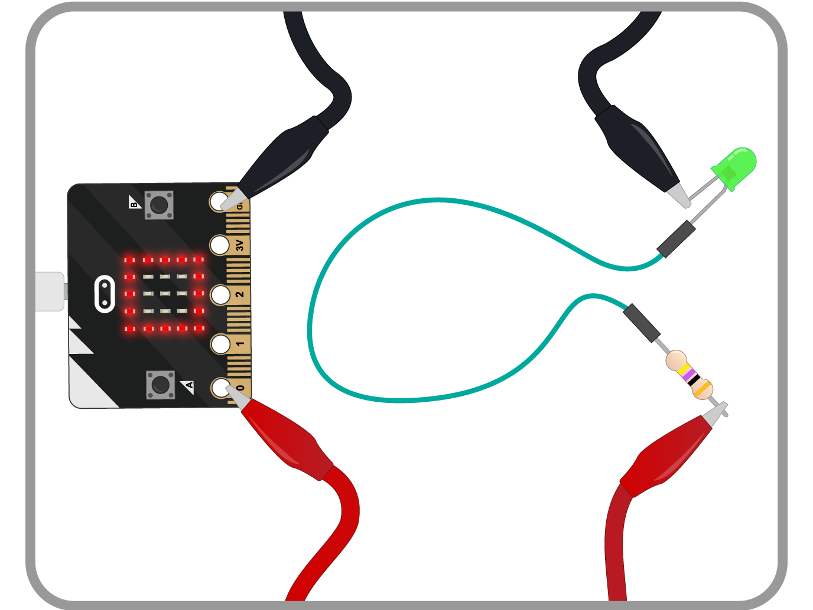

## More features of the micro:bit

Some of the cool features on the micro:bit are the GPIO pins, the accelerometer, and compass.

- If you have access to an LED, a resistor and some leads, you can connect up the micro:bit to the components as shown below. If you don't, then no need to worry. The program you will write also uses the LED matrix.

	

2. You're going to write a little bit of code that will light an external LED, and some of the LEDs on the matrix, when the micro:bit is shaken. Have a read through the code below, and then use mu to push it to the micro:bit.

  ```python
  from microbit import *

  shake = False
  while True:
      if shake:
          pin0.write_digital(1)
          display.show(Image.SQUARE)
      else:
          pin0.write_digital(0)
          display.clear()
      if accelerometer.was_gesture('shake'):
          shake = not shake
          sleep(500)
  ```

3. Flash the code to your micro:bit and then give it a good shake. Do you see the LEDs changing?

